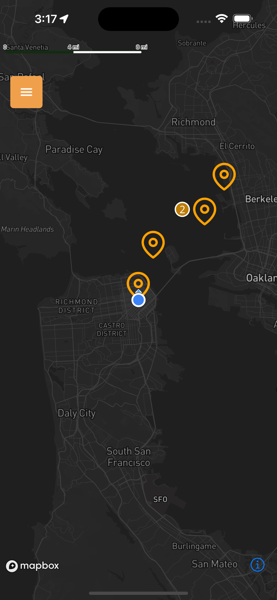
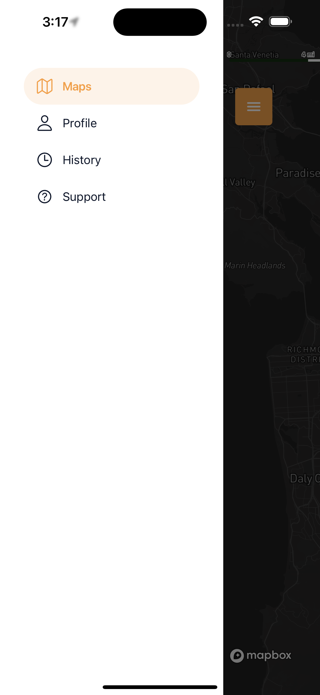
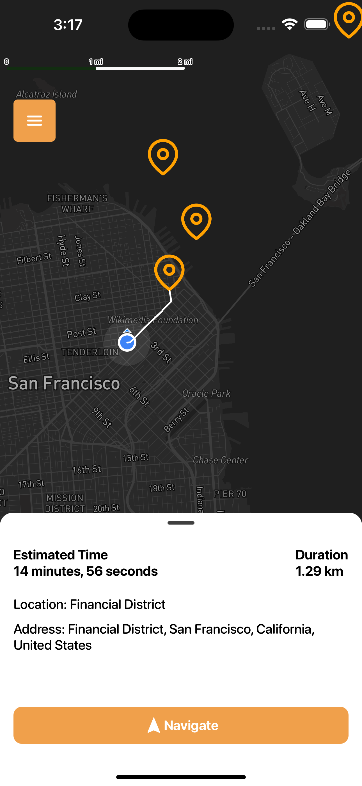
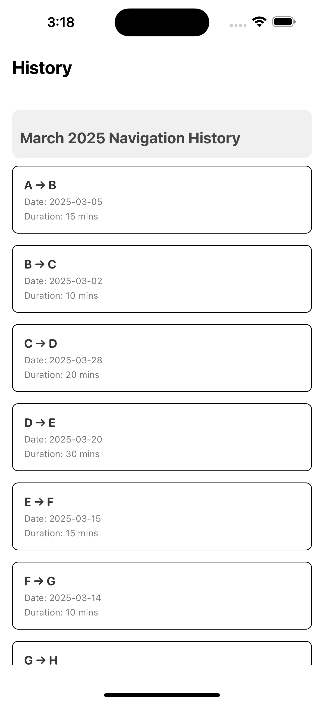
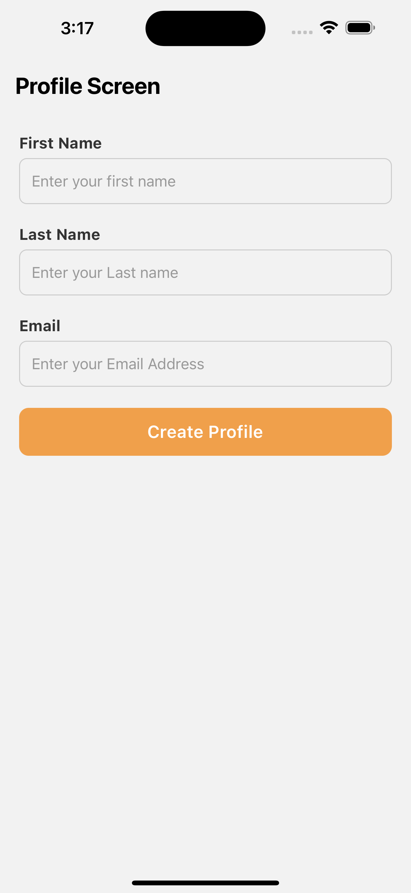
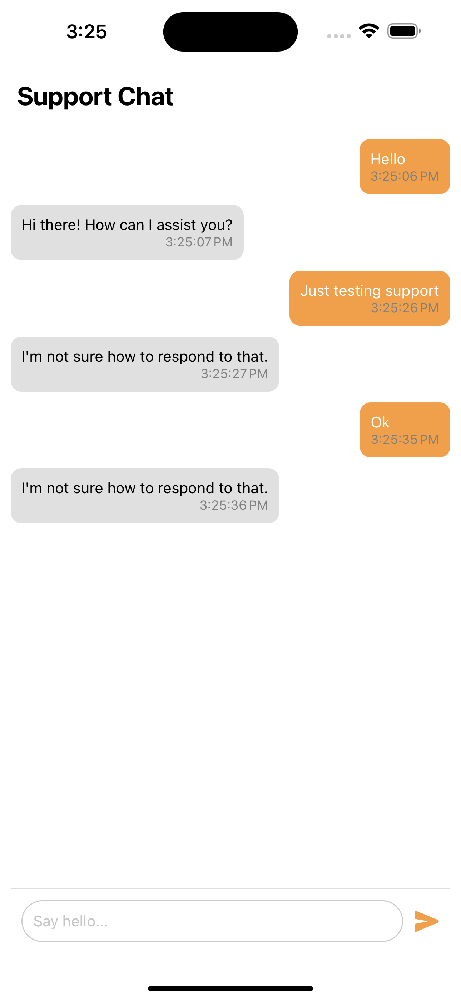
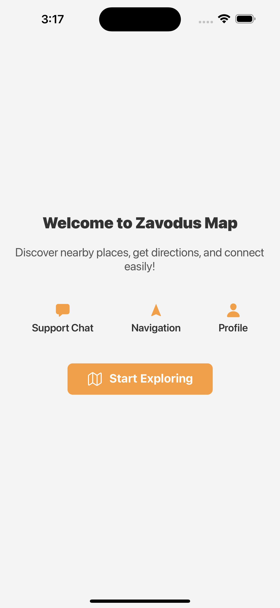

# Zavodus Map

## 🚀 Overview

Zavodus Map is a **React Native** mobile application that integrates **Mapbox** for displaying maps and navigation. It features a **drawer menu**, a **support chat demo**, and allows users to navigate from their **current location** to predefined markers on the map.

## 🛠 Tech Stack

- **React Native**
- **Expo**
- **Mapbox**
- **Zod** (Validation)
- **React Hook Form** (Form handling)
- **Reanimated & Gesture Handler** (Smooth animations & gestures)
- **Zustand** (State management)
- **ky** (HTTP client)
- **@turf/helpers** (Geospatial calculations)
- **@hookform/resolvers** (Form validation resolver)

## ✨ Features

- **Drawer Navigation** with Profile, Support, and History screens
- **Map with 7 random markers**
- **Clicking on markers shows popups with details**
- **Navigation from user’s current location to a selected marker**
- **Demo Support Chat** for user interaction

## 📥 Installation

```sh
# Clone the repository
git clone <repo>
cd zavodus-map

# Install dependencies
npm install

# Create environment variables
cp .env.example .env # (Edit .env with your API keys)

# Clean and prebuild the project
npx expo prebuild --clean

# Run the app
npx expo run:ios # For iOS
npx expo run:android # For Android
```

## 📸 Screenshots

Here are some screenshots of the app:

### 🗺️ Map View



### 📂 Drawer Menu



### 📌 Marker Pop-up



### 📜 History View



### 👤 Profile View



### 🆘 Support Chat



### 🚀 Onboarding Page



## 🎥 Demo Video

<video src="assets/videos/demo.mp4" controls width="600"></video>

## 🔧 Customization

- **Mapbox API Key:** You need to **register on** [Mapbox](https://mapbox.com) and obtain an API key.
- **Modular Structure:** Use the following command to generate new modules dynamically:

```sh
node generate-module.mjs modules <module-name>
```

## 🛠 Known Issues

✅ No known issues or bugs.

**Author:** Osieta OgheneKewve Gift  
Feel free to contribute, report issues, or request features!
